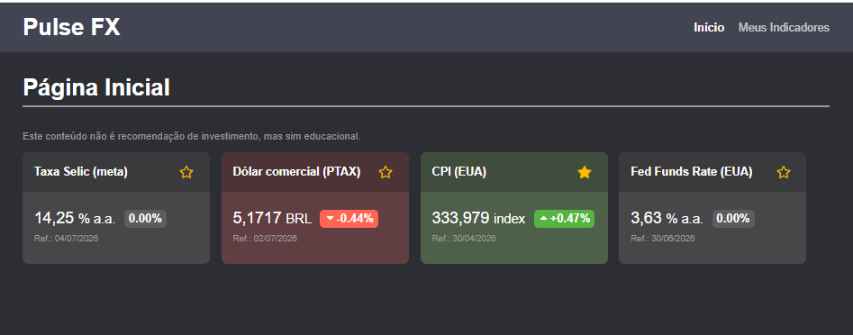
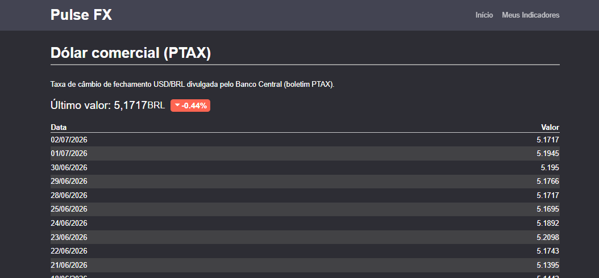
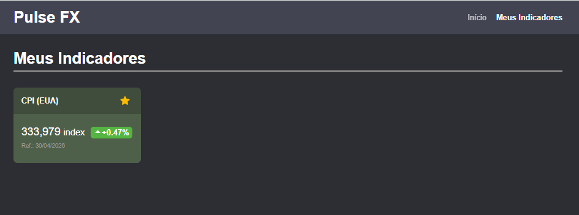

# Pulse FX

Projeto que fiz pra acompanhar câmbio (USD/BRL) e alguns indicadores macro relevantes, usando só
fontes de dados públicas (BCB e FRED). Como o projeto é um MVP, a ideia aqui não foi cobrir todo caso
de uso possível, mas mostrar uma base sólida: API bem dividida em camadas, dados persistidos de verdade,
testes, migrations versionadas e tudo rodando em Docker sem eu precisar explicar passo a passo
por chat depois.

## Sumário
- [Screenshots](#screenshots)
- [Como rodar](#como-rodar)
- [Variáveis de ambiente](#variáveis-de-ambiente)
- [Arquitetura](#arquitetura)
- [Séries que escolhi](#séries-que-escolhi)
- [Regra de variação percentual](#regra-de-variação-percentual)
- [Como funciona a sincronização](#como-funciona-a-sincronização)
- [Decisões e trade-offs](#decisões-e-trade-offs)
- [Rodando o frontend](#rodando-o-frontend)
- [Testes e lint](#testes-e-lint)
- [Troubleshooting](#troubleshooting)

## Screenshots

**Dashboard**: cards com os 4 indicadores, valor mais recente, data de referência e variação:



**Detalhe do indicador**: histórico em tabela e texto sobre limitações dos dados:



**Meus Indicadores**: favoritos:



## Como rodar

Pré-requisito: Docker e Docker Compose instalados (Docker Desktop cobre os dois).
Não é necessário ter Node instalado para rodar via Docker, mas é necessário tê-lo para
para desenvolvimento fora dele (ver [Rodando o frontend](#rodando-o-frontend)).

```bash
cp .env.example .env
```

Antes de subir, edite o `.env` e preencha duas coisas:
- `FRED_API_KEY`: pega em https://fredaccount.stlouisfed.org/apikeys (é grátis, leva menos de
  2 minutos pra criar conta e gerar a chave)
- `ADMIN_API_KEY`: qualquer string aleatória forte. Se quiser gerar uma rápido:
  `openssl rand -hex 32`

Com isso feito:

```bash
docker compose up --build
```

- Frontend: http://localhost:5173
- Gateway (API): http://localhost:4000
- RabbitMQ (painel de administração): http://localhost:15672
- Postgres: localhost:5433

O banco começa vazio. Quem popula o catálogo de indicadores é o próprio `api-sync` assim que
sobe, e ele já dispara a primeira sincronização de dados reais imediatamente no boot (não
precisa esperar o cron periódico). Se por algum motivo quiser forçar de novo manualmente:

```bash
curl -X POST http://localhost:4000/admin/sync \
  -H "X-Admin-Key: <o que você colocou em ADMIN_API_KEY>"
```

## Variáveis de ambiente

Postgres, RabbitMQ, chave do FRED, chave admin, TTL de sync, portas. Um detalhe que vale
mencionar: eu não coloco `DATABASE_URL` no `.env`, pois ela é montada automaticamente no
`docker-compose.yml` a partir de `POSTGRES_USER`/`PASSWORD`/`DB`. Fiz assim depois de apanhar
um pouco com as duas strings ficando dessincronizadas quando eu mudava só uma das duas.

## Arquitetura

```
web (React+TS) → gateway → api-public  → Postgres
                        ↘ api-sync (cron BCB/FRED) → Postgres
                                     ↘ publica "indicator.updated" → RabbitMQ → api-public (invalida cache)
```

Pensei bastante em como dividir o backend antes de chegar nesse desenho. Cheguei a considerar
separar por "domínio" (tipo users/orders), mas isso não fazia sentido aqui, pois o Pulse FX
não tem múltiplas entidades de negócio, tem duas **responsabilidades** com necessidades bem
diferentes: servir leitura rápida pro frontend, e sincronizar com fontes externas (que é lento,
pode falhar, precisa de TTL). Por isso separei assim:

- **web**: dashboard, tela de detalhe do indicador, e uma tela própria de "Meus Indicadores"
  (`/favoritos`) que lista só os favoritados. Favoritar/desfavoritar funciona tanto lá quanto no
  dashboard, através de um hook compartilhado (`useFavorites`) pra não duplicar a lógica entre
  as duas telas.
- **gateway**: entrada única de HTTP. `/api/*` vai pro `api-public`, `/admin/*` vai pro
  `api-sync` (e esse último exige o header `X-Admin-Key`).
- **api-public**: só leitura (dashboard, detalhe, favoritos). Guarda um cache simples em memória
  que é invalidado quando chega o evento `indicator.updated` do RabbitMQ, em vez de eu ficar
  batendo no Postgres toda hora ou confiar só em TTL de cache.
- **api-sync**: roda um cron interno a cada 15 minutos. Pra cada indicador do catálogo, checa se
  já passou o TTL configurado (`SYNC_TTL_MINUTES`), e só nesse caso ele de fato chama BCB/FRED.
  Depois de salvar dado novo, publica o evento no RabbitMQ. Também expõe `POST /admin/sync` para
  eu poder forçar isso manualmente sem esperar o cron.
- **packages/core**: aqui mora a regra de negócio (cálculo de variação %), o catálogo de
  indicadores e os repositórios. Tudo está compartilhado entre `api-public` e `api-sync` para eu
  não duplicar lógica entre os dois.
- **packages/db**: schema do Prisma + client. Fonte única de verdade do modelo de dados.
- **Postgres**: guarda observações, favoritos e o estado de sincronização de cada indicador.
- **RabbitMQ**: é só isso mesmo, o `api-sync` publica um evento quando termina de sincronizar, e
  o `api-public` escuta pra saber quando invalidar o cache.

Cada serviço de backend tem seu próprio Dockerfile e builda/deploya separado dos outros.

## Séries que escolhi

| Código | Fonte | Tipo | Por que escolhi essa |
|---|---|---|---|
| `USD_BRL_PTAX` | BCB (PTAX) | Diária | É literalmente a taxa de câmbio de referência usada em contrato/balanço no Brasil. Quem quer acompanhar câmbio quer essa, não uma cotação qualquer de mercado paralelo. |
| `SELIC_META` | BCB (SGS 432) | Diária | A Selic é o principal motivo do real ser (ou não) atrativo frente ao dólar. Botar ela do lado do câmbio já dá um contexto que sozinho o câmbio não dá. |
| `US_FED_FUNDS_RATE` | FRED (`DFF`) | Diária | É o "equivalente americano" da Selic. O diferencial de juros Brasil x EUA é um dos fatores que mais move fluxo de capital pra cá. Sem isso o câmbio fica sem contexto do lado de fora. |
| `US_CPI` | FRED (`CPIAUCSL`) | Mensal | Inflação americana é o que molda as decisões de juros do Fed, e decisão do Fed mexe com dólar no mundo inteiro. É o indicador mensal mais direto pra entender pra onde o Fed deve ir. |

Documentação que usei de referência: o Swagger da PTAX, o portal do SGS, e a doc do endpoint
`fred/series/observations` (links no enunciado original).

## Regra de variação percentual

Isso tá em `packages/core/src/domain/variation.ts`, com teste isolado em `variation.test.ts`.

- **Último valor**: a observação mais recente que já está no Postgres (o que já foi sincronizado, 
  respeitando o TTL)
- **Data de referência**: a data da própria observação, não a hora em que alguém consultou.
- **Séries diárias** (câmbio, Selic, Fed Funds): comparo com a observação anterior disponível
  (N=1). Como só salvo o dia em que a fonte publicou dado, fins de semana/feriado não geram observação.
  A "observação anterior" já é o último dado útil válido antes do atual.
- **Série mensal** (CPI): comparo mês contra mês (MoM, N=1). Decidi não usar "últimos X dias" para
  série mensal porque se um dia eu quiser trocar pra variação ano a ano (YoY), basta mudar uma
  constante (`DEFAULT_COMPARISON_WINDOW.MONTHLY = 12`).
- A mesma função é usada no dashboard e no detalhe, então os dois nunca vão mostrar número
  diferente pro mesmo indicador.

## Como funciona a sincronização

- TTL configurável por `SYNC_TTL_MINUTES` (deixei 60 min de padrão).
- O cron do `api-sync` roda a cada 15 minutos, mas só chama a fonte externa de verdade se o TTL
  daquele indicador específico já tiver vencido. É isso que evita eu ficar martelando a API do
  BCB/FRED sem necessidade.
- `POST /admin/sync` força uma sincronização na hora (com `?force=true` ignora o TTL também).
  Protegido por `X-Admin-Key`.
- Toda sincronização que dá certo publica `indicator.updated` no RabbitMQ. O `api-public` escuta
  isso e limpa só o cache daquele indicador (e o do dashboard, que agrega todos).

## Decisões e trade-offs

Umas coisas que decidi no caminho e acho importante deixar registrado:

- **Dois serviços de API, não vários microsserviços de domínio.** Já expliquei isso lá em cima,
  mas reforçando: não tem "entidade de negócio" suficiente aqui pra justificar dividir por
  domínio. O que separei foi por responsabilidade (leitura vs. sincronização), que é uma
  diferença real de comportamento (rápido/sem I/O externo vs. lento/precisa de retry e TTL).
- **RabbitMQ só publica um evento.** De propósito. A ideia era mostrar desacoplamento de verdade
  (o `api-sync` não sabe nem se importa quem tá ouvindo), sem inflar a complexidade só pra
  parecer mais "enterprise".
- **Favoritos sem multiusuário.** Não tem tela de login nesse MVP, então `Favorite` não tem
  relação com usuário nenhum. Mas é persistido de verdade no Postgres (não é `localStorage`), daí
  sobrevive a redeploy. Se um dia eu quiser adicionar login, é só colocar `userId` na tabela e no
  filtro das queries.
- **Cache em memória, não Redis.** Só tem uma réplica do `api-public` rodando, então o cache em
  memória invalidado por evento resolve bem. Se algum dia isso escalar horizontalmente, esse
  cache precisa virar Redis (compartilhado entre réplicas). Hoje, ele não seria consistente entre
  instâncias diferentes.
- **Prisma com migration versionada.** O schema fica em `packages/db/prisma/schema.prisma`, a
  migration inicial tá versionada em `packages/db/prisma/migrations/`. Um serviço `migrate` no
  compose roda `prisma migrate deploy` antes de qualquer API subir.
- **Tentei um teste de integração real (Testcontainers) e recuei.** A ideia era subir um
  Postgres efêmero de verdade e rodar os repositórios contra ele, em vez de mockar o Prisma. Não
  consegui fazer funcionar no Windows + Docker Desktop a tempo, pois o `.start()` do container
  travava indefinidamente, provavelmente relacionado ao container auxiliar "Ryuk" que o
  Testcontainers sobe pra limpeza automática. Preferi voltar pros testes com mock (que já
  cobrem o mínimo exigido) a entregar um teste que trava, em vez de investir mais tempo tentando
  resolver o problema perto do prazo. Fica como próximo passo real.

## Rodando o frontend

**Fora do Docker** (o jeito que eu mais uso no dia a dia):

```bash
npm install -w apps/web
npm run dev:web
```

Abre em http://localhost:5173 e aponta pro gateway (`VITE_API_URL`, padrão
`http://localhost:4000`).

**Dentro do Docker, com hot-reload:** o `docker-compose.override.yml` já é aplicado
automaticamente pelo `docker compose up` (não precisa passar flag nenhuma) e troca o serviço
`web` do build de produção pro Vite dev server, com o código montado como volume. Qualquer
mudança local aparece na hora, sem eu precisar destruir/reconstruir o container.

```bash
docker compose up --build web
```

Se quiser voltar pro comportamento de produção (Nginx servindo o build), é só tirar esse arquivo
do caminho antes de subir:

```bash
mv docker-compose.override.yml docker-compose.override.yml.disabled
docker compose up --build web
```

## Testes e lint

```bash
npm install
npm test
```

Isso roda os testes de todos os workspaces. Os 5 arquivos de teste que tenho hoje:

1. `packages/core/src/domain/variation.test.ts`: a regra de variação em si.
2. `packages/core/src/repositories/observation.repository.test.ts`: repositório, com Prisma
   mockado.
3. `apps/api-sync/src/routes/admin.routes.test.ts`: autenticação da rota admin.
4. `apps/api-public/src/routes/indicators.routes.test.ts`: dashboard e detalhe.
5. `apps/web/src/components/VariationBadge.test.tsx`: componente React.

Ainda não tenho um teste de integração de verdade (API batendo em Postgres real). Cheguei a
tentar com Testcontainers (ver "Decisões e trade-offs"), mas não deu tempo de resolver antes do
prazo. Os testes de repositório/HTTP hoje usam mock.

Lint é um `eslint.config.mjs` único na raiz, cobrindo o monorepo inteiro (backend Node/TS e
frontend React/TS no mesmo arquivo, cada um com suas regras específicas. Por exemplo, o frontend
ganha regras específicas de JSX/hooks):

```bash
npm run lint       # só reporta
npm run lint:fix   # corrige o que dá pra corrigir sozinho
```

## Troubleshooting

Só documentando aqui os perrengues que já passei pra não esquecer:

- **`Failed to resolve entry for package "@pulse-fx/db"` (ou `@pulse-fx/core`) ao rodar
  testes**: `packages/db` e `packages/core` apontam `main`/`types` pra `dist/`, não pra `src/`
  (isso é necessário pro `node dist/index.js` funcionar dentro do Docker, sem `ts-node`). Só que
  isso significa que, se você nunca rodou o build desses dois pacotes localmente, `dist/` não
  existe e a resolução do módulo falha. `npm test` (na raiz) já builda os dois automaticamente
  antes de rodar os testes (`pretest` no `package.json` raiz e em cada workspace que depende
  deles). Se você rodar `vitest` direto (sem passar pelo `npm test`), esse passo é pulado. Nesse
  caso, builda manualmente uma vez:
  ```bash
  npm run generate -w packages/db
  npm run build -w packages/db
  npm run build -w packages/core
  ```
  Pra watch mode de um workspace específico, use o script `test:watch` de dentro dele. Ele já
  chama o build explicitamente antes de subir o `vitest` (o hook automático `pretest` do npm só
  dispara antes do script chamado exatamente `test`; como `test:watch` é nome customizado, ele
  não entra nessa convenção sozinho, por isso o `test:watch` chama `npm run pretest` na mão antes
  do `vitest`). E não use `vitest` direto com `-w` esperando que seja "workspace" como no `npm`.
  No `vitest`, `-w` é atalho de `--watch`:
  ```bash
  npm run test:watch -w packages/core
  ```
- **Dashboard mostrando "— sem dado suficiente" em tudo**: normalmente significa que ainda não
  existe observação nenhuma persistida (ou só existe uma, e a variação precisa de pelo menos
  duas pra calcular). Isso **não** tem relação com fim de semana. A regra de variação usa a
  observação anterior disponível dentro do que já foi persistido, não conta dia de calendário
  (ver seção de variação percentual mais acima). A causa mais provável é: o container do
  `api-sync` acabou de subir (ou o volume do Postgres foi resetado) e o cron ainda não rodou.
  Desde a correção mais recente, o `api-sync` já dispara uma sincronização assim que sobe, sem
  esperar os 15 minutos do cron. Se ainda estiver vendo isso, force manualmente:
  ```bash
  curl -X POST "http://localhost:4000/admin/sync?force=true" -H "X-Admin-Key: <sua chave>"
  ```
- **`BCB PTAX respondeu 502`**: é uma falha transitória do lado do próprio BCB (Bad Gateway).
  A API do Olinda/OData da PTAX é visivelmente mais instável que a do SGS (usada pela Selic,
  por exemplo). O `fetchPtax`/`fetchSgsSeries` já tentam de novo automaticamente em caso de
  502/503/504 (até 2 vezes, com backoff), mas se ainda assim falhar, é só forçar de novo depois:
  ```bash
  curl -X POST "http://localhost:4000/admin/sync?force=true" -H "X-Admin-Key: <sua chave>"
  ```
- **`role "..." does not exist` no Postgres**: o Postgres só cria usuário/banco na primeira vez
  que o volume é inicializado. Se você já tinha subido antes (mesmo sem sucesso) e mudou o
  `.env` depois, isso não vai ter efeito nenhum sobre o volume já existente. Resolve com:
  ```bash
  docker compose down -v
  docker compose up --build
  ```
- **`migrate` falhando com erro de Prisma/OpenSSL** (tipo `Could not parse schema engine
  response` ou aviso de "libssl/openssl version"): é o clássico problema do Prisma em imagem
  Alpine sem OpenSSL. Já resolvi isso no `schema.prisma` (`binaryTargets`) e nos Dockerfiles
  (`apk add openssl`), e se isso voltar a acontecer, provavelmente é cache de build antigo:
  `docker compose build --no-cache migrate api-public api-sync`.
- **`api-public`/`api-sync` reiniciando em loop**: normalmente é sintoma de um dos dois problemas
  acima. Depois de corrigir, `docker compose up --build --force-recreate` resolve.
- **pgAdmin não conecta / erro de senha mesmo com senha certa**: tinha um Postgres nativo instalado
  no Windows escutando também na porta 5432, e o cliente ia parar nele em vez de ir no container. No Windows: `netstat -ano | findstr :5432` e depois `tasklist /FI "PID eq <pid>"` pra achar o processo. Por causa disso, o Postgres do Docker aqui expõe a porta
  **5433** no host (`5433:5432` no compose), então no pgAdmin é `localhost:5433`, não `5432`. A
  comunicação interna entre os serviços continua em `postgres:5432` normal, isso só afeta quem
  conecta de fora.
- Depois de mexer em `packages/db` ou `packages/core`, precisa reconstruir as imagens que
  dependem deles (`--build`). O client do Prisma e o build TypeScript são gerados em tempo de build.
